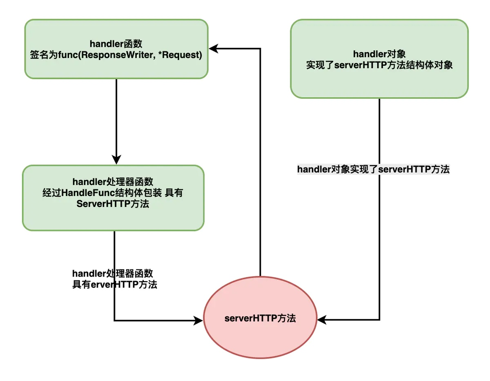
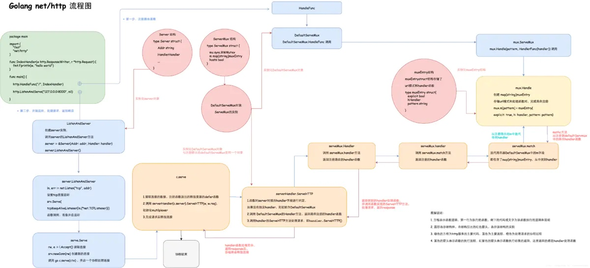
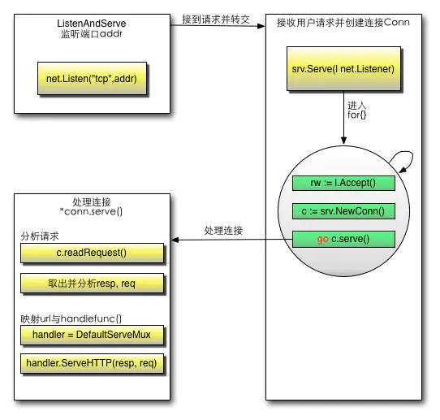

# Golang构建http服务
> 很多框架都是在 最简单的http服务上做扩展的的，基本上都是遵循http协议，将底层的封装好，我们使用web框架只要写业务逻辑，填代码就可以了，不用关心底层实现。

下面👇实现一个最简单的http服务
```Go
package main

import (
    "fmt"
    "net/http"
)

func IndexHandler(w http.ResponseWriter, r *http.Request) {
    fmt.Fprintln(w, "hello world")
}

func main() {
    http.HandleFunc("/", IndexHandler)
    http.ListenAndServe("127.0.0.0:8000", nil)
}
```
上面只使用了 go的内置包 net/http

## HTTP
除去细节，理解HTTP构建的网络应用只要关注两个端--客户端(client)和服务端(server)，两个端的交互来自client的request，以及server端的response。所谓的http服务器，主要在于如何接受client的request，并向client返回response。

接收request的过程中，最重要的莫过于路由(router)，即实现一个Multiplexer器。Go中既可以使用内置的mutilplexer--DefaultServeMux,也可以自定义。Multiplexer路由的目的就是为了找到处理器函数(hander),后者将对request进行处理，同时构建response。

简单总结就是这个流程：
```Go
client -> Request -> Multiplexer(router)->handler ->Response -> client
```



因此，理解go中的http服务，最重要的就是要理解`Multiplexer`和`hander`，Golang中的`Multiplexer`基于`ServerMux`结构，同时也实现了`Handler`接口

- `handler`函数：具有func(w http.ResponseWriter, r *http.Requests)签名的函数
- `handler`处理器(函数)：经过HanderFunc结构包装的handler函数，它实现了ServeHTTP接口方法的函数。调用handler处理器的ServeHTTP方法时，即调用handler函数本身。
- `handler`对象：实现了Hander接口ServeHTTP方法的结构。
**handler函数和handler对象的差别在于， 一个是函数，另一个是结构体，他们都有实现了serverHTTP方法，很多情况下，他们是类似的。**

Golang的http处理流程可以用下面一张图表示，后面内容是针对图进行说明：



### Http包的三个关键类型

1. Handler接口
2. ServeMux接口
3. HandlerFunc适配器
4. Server

#### Handler
Golang没有继承，类多态的方法可以通过接口实现。所谓接口则是定义声明了函数签名，任何结构只要实现了与接口函数签名相同的方法，就等同于实现了接口。go的http服务都是基于handler进行处理的。

```Go
// A Handler responds to an HTTP request.
//
// ServeHTTP should write reply headers and data to the ResponseWriter
// and then return. Returning signals that the request is finished; it
// is not valid to use the ResponseWriter or read from the
// Request.Body after or concurrently with the completion of the
// ServeHTTP call.
//
// Depending on the HTTP client software, HTTP protocol version, and
// any intermediaries between the client and the Go server, it may not
// be possible to read from the Request.Body after writing to the
// ResponseWriter. Cautious handlers should read the Request.Body
// first, and then reply.
//
// Except for reading the body, handlers should not modify the
// provided Request.
//
// If ServeHTTP panics, the server (the caller of ServeHTTP) assumes
// that the effect of the panic was isolated to the active request.
// It recovers the panic, logs a stack trace to the server error log,
// and either closes the network connection or sends an HTTP/2
// RST_STREAM, depending on the HTTP protocol. To abort a handler so
// the client sees an interrupted response but the server doesn't log
// an error, panic with the value ErrAbortHandler.
type Handler interface {
    ServeHTTP(ResponseWriter, *Request)   //路由具体实现
}
```
**任何结构体，只要实现了ServeHTTP方法，这个结构就可以称之为handler对象。**ServeMux会使用handler并调用其ServeHTTP方法处理请求并返回响应。
所有请求的处理器、路由ServeMux都满足该接口。

#### ServeMux
了解了Handler之后，再看`ServeMux`。
**HTTP请求的多路转接器（路由）**，它负责将每一个接收到的请求的URL与一个注册模式的列表进行匹配，并调用和URL最匹配的模式的处理器。它内部用一个map来保存所有处理器Handler。
ServeMux源码很简单：
```Go
type ServeMux struct {
    mu sync.RWMutex   //锁，由于请求涉及到并发处理，因此这里需要一个锁机制
    m  map[string]muxEntry  // 路由规则，一个string对应一个mux实体，这里的string就是注册的路由表达式
    hosts bool // 是否在任意的规则中带有host信息
} 
type muxEntry struct {
    h        Handler // 这个路由表达式对应哪个handler
    pattern  string  //匹配字符串
}
```
`ServeMux`结构中最重要的字段为m，这是一个map，key是一些url模式，value是一个muxEntry结构，后者里定义存储了具体的url模式和handler。

当然，所谓的ServeMux也实现了ServeHTTP接口，也算是一个handler，不过ServeMux的ServeHTTP方法不是用来处理request和respone，而是用来找到路由注册的handler。

- http包有一个包级别变量DefaultServeMux，表示默认路由：var DefaultServeMux = NewServeMux()，使用包级别的http.Handle()、http.HandleFunc()方法注册处理器时都是注册到该路由中。

```Go
// NewServeMux allocates and returns a new ServeMux.
func NewServeMux() *ServeMux { return new(ServeMux) }

// DefaultServeMux is the default ServeMux used by Serve.
var DefaultServeMux = &defaultServeMux

var defaultServeMux ServeMux
```

- ServeMux结构体有ServeHTTP()方法（满足Handler接口），主要用于间接调用它所保存的muxEntry中保存的Handler处理器的ServeHTTP()方法。

#### HandlerFunc适配器

```Go
// The HandlerFunc type is an adapter to allow the use of
// ordinary functions as HTTP handlers. If f is a function
// with the appropriate signature, HandlerFunc(f) is a
// Handler that calls f.
type HandlerFunc func(ResponseWriter, *Request)

// ServeHTTP calls f(w, r).
func (f HandlerFunc) ServeHTTP(w ResponseWriter, r *Request) {
    f(w, r)
}
```

> 自行定义的处理函数转换为Handler类型就是HandlerFunc调用之后的结果，这个类型默认就实现了ServeHTTP这个接口，即我们调用了HandlerFunc(f),强制类型转换f成为HandlerFunc类型，这样f就拥有了ServeHTTP方法。

### Server
除了`ServeMux`和`Handler`，还有一个结构`Server`需要了解。从`http.ListenAndServe`的源码可以看出，它创建了一个server对象，并调用server对象的ListenAndServe方法：
```Go
func ListenAndServe(addr string, handler Handler) error {
    server := &Server{Addr: addr, Handler: handler}
    return server.ListenAndServe()
}
```

查看server的结构如下：

```Go
type Server struct {
    Addr         string        
    Handler      Handler       
    ReadTimeout  time.Duration 
    WriteTimeout time.Duration 
    TLSConfig    *tls.Config   

    MaxHeaderBytes int

    TLSNextProto map[string]func(*Server, *tls.Conn, Handler)

    ConnState func(net.Conn, ConnState)
    ErrorLog *log.Logger
    disableKeepAlives int32     nextProtoOnce     sync.Once 
    nextProtoErr      error     
}
```
server结构存储了服务器处理请求常见的字段。其中Handler字段也保留Hander接口。如果Server接口没有提供Handler结构对象，那么会使用DefaultServeMux做Multiplexer。

### 创建HTTP服务
创建一个http服务，大致需要经历两个过程，首先需要注册路由，即提供url模式和handler函数的映射，其次就是实例化一个server对象，并开启对客户端的监听。
```Go
http.HandleFunc("/", indexHandler)
http.ListenAndServe("127.0.0.1:8000", nil)
```
或者
```Go
server := &Server{Addr: addr, Handler: handler}
server.ListenAndServe()
```

#### http注册路由
​ net/http包暴露的注册路由的api很简单，http.HandleFunc选取了DefaultServeMux作为multiplexer：
```Go
func HandleFunc(pattern string, handler func(ResponseWriter, *Request)) {
    DefaultServeMux.HandleFunc(pattern, handler)
}
```
​ 实际上，DefaultServeMux是ServeMux的一个实例。当然http包也提供了NewServeMux方法创建一个ServeMux实例，默认则创建一个DefaultServeMux：
```Go
// NewServeMux allocates and returns a new ServeMux.
func NewServeMux() *ServeMux {
    return new(ServeMux)
}

// DefaultServeMux is the default ServeMux used by Serve.
var DefaultServeMux = &defaultServeMux

var defaultServeMux ServeMux
```
注意，go创建实例的过程中，也可以使用指针方式，即
```Go
type Server struct{}
server := Server{}
```
和下面的一样都可以创建Server的实例
```Go
var DefaultServer Server
var server = &DefalutServer
```
因此DefaultServeMux的HandleFunc(pattern,handler)方法实际是定义在ServeMux下的：
```Go
func (mux *ServeMux) HandleFunc(pattern string, handler func(ResponseWriter, *Request)) {
    mux.Handle(pattern, HandlerFunc(handler))
}
```
上述代码中，HandlerFunc是一个函数类型。同时实现了Handler接口的ServeHTTP方法。使用HandlerFunc类型包装一下路由定义的indexHandler函数，其目的就是为了让这个函数也实现ServeHTTP方法，即转变成一个handler处理器(函数)。
```Go
type HandlerFunc func(ResponseWriter, *Request)

func (f HandlerFunc) ServeHTTP(w ResponseWriter, r *Request) {
    f(w, r)
}
```
一旦这样做了，就意味着我们的indexHandler函数也有了ServeHTTP方法。 此外，ServeMux的Handle方法，将会对pattern和handler函数做一个map映射：
```Go
func (mux *ServeMux) Handle(pattern string, handler Handler) {
    mux.mu.Lock()
    defer mux.mu.Unlock()

    if pattern == "" {
        panic("http: invalid pattern " + pattern)
    }
    if handler == nil {
        panic("http: nil handler")
    }
    if mux.m[pattern].explicit {
        panic("http: multiple registrations for " + pattern)
    }

    if mux.m == nil {
        mux.m = make(map[string]muxEntry)
    }
    mux.m[pattern] = muxEntry{explicit: true, h: handler, pattern: pattern}

    if pattern[0] != '/' {
        mux.hosts = true
    }

    n := len(pattern)
    if n > 0 && pattern[n-1] == '/' && !mux.m[pattern[0:n-1]].explicit {

        path := pattern
        if pattern[0] != '/' {
            path = pattern[strings.Index(pattern, "/"):]
        }
        url := &url.URL{Path: path}
        mux.m[pattern[0:n-1]] = muxEntry{h: RedirectHandler(url.String(), StatusMovedPermanently), pattern: pattern}
    }
}
```
由此可见，Handle函数的主要目的在于把handler和pattern模式绑定到map[string]muxEntry的map上，其中muxEntry保存了更多pattern和handler的信息。Server的m字段就是map[string]muxEntry这样一个map。

此时，pattern和handler的路由注册完成。

#### 开启监听
注册好路由之后，启动web服务还需要开启服务器监听。http的ListenAndServer方法中可以看到创建了一个Server对象，并调用了Server对象的同名方法：
```Go
func ListenAndServe(addr string, handler Handler) error {
    server := &Server{Addr: addr, Handler: handler}
    return server.ListenAndServe()
}

func (srv Server) ListenAndServe() error {
    addr := srv.Addr
    if addr == "" {
        addr = ":http"
    }
    ln, err := net.Listen("tcp", addr)
    if err != nil {
        return err
    }
    return srv.Serve(tcpKeepAliveListener{ln.(net.TCPListener)})
}
```
Server的ListenAndServer方法中，会初始化监听地址Addr，同时调用Listen方法设置监听。最后将监听的TCP对象传入Serve方法：
```Go
func (srv *Server) Serve(l net.Listener) error {
    defer l.Close()
    ...

    baseCtx := context.Background()
    ctx := context.WithValue(baseCtx, ServerContextKey, srv)
    ctx = context.WithValue(ctx, LocalAddrContextKey, l.Addr())
    for {
        rw, e := l.Accept()
        ...
        c := srv.newConn(rw)
        c.setState(c.rwc, StateNew) // before Serve can return
        go c.serve(ctx)
    }
}
```

#### 处理请求
监听开启之后，一旦客户端请求到底，go就开启一个协程处理请求，主要逻辑都在server方法之中。

serve方法比较长，其主要职能就是，创建一个上下文对象，然后调用Listener的Accept方法用来获取连接数据并使用newConn方法创建连接对象。最后使用goroutein协程的方式处理连接请求。因此每一个连接都开启了一个协程，请求的上下文都不同，同时又保证了go的高并发。serve也是一个长长的方法：
```Go
func (c *conn) serve(ctx context.Context) {
    c.remoteAddr = c.rwc.RemoteAddr().String()
    defer func() {
        if err := recover(); err != nil {
            const size = 64 << 10
            buf := make([]byte, size)
            buf = buf[:runtime.Stack(buf, false)]
            c.server.logf("http: panic serving %v: %v\n%s", c.remoteAddr, err, buf)
        }
        if !c.hijacked() {
            c.close()
            c.setState(c.rwc, StateClosed)
        }
    }()

    ...

    for {
        w, err := c.readRequest(ctx)
        if c.r.remain != c.server.initialReadLimitSize() {
            // If we read any bytes off the wire, we're active.
            c.setState(c.rwc, StateActive)
        }
        ...
        
        }
        
        ...
    
        serverHandler{c.server}.ServeHTTP(w, w.req)
        w.cancelCtx()
        if c.hijacked() {
            return
        }
        w.finishRequest()
        if !w.shouldReuseConnection() {
            if w.requestBodyLimitHit || w.closedRequestBodyEarly() {
                c.closeWriteAndWait()
            }
            return
        }
        c.setState(c.rwc, StateIdle)
    }
}
```
尽管serve很长，里面的结构和逻辑还是很清晰的，使用defer定义了函数退出时，连接关闭相关的处理。然后就是读取连接的网络数据，并处理读取完毕时候的状态。接下来就是调用serverHandler{c.server}.ServeHTTP（w,w.req)方法处理请求了。最后就是请求处理完毕的逻辑。serverHandler是一个重要的结构，它仅有一个字段，即Server结构，同时它也实现了Hander接口方法ServeHTTP，同时它也实现了Handler接口方法ServeHTTP，并在该接口方法中做了一个重要的事情，初始化multiplexer路由多路复用器。如果server对象没有制定Handler，则使用默认的DefaultServeMux作为路由Multiplexer。并调用初始化Handler的ServeHTTP方法。
```Go
type serverHandler struct {
    srv *Server
}

func (sh serverHandler) ServeHTTP(rw ResponseWriter, req Request) {
    handler := sh.srv.Handler
    if handler == nil {
        handler = DefaultServeMux
    }
    if req.RequestURI == "" && req.Method == "OPTIONS" {
        handler = globalOptionsHandler{}
    }
    handler.ServeHTTP(rw, req)
}
```
这里DefaultServeMux的ServeHTTP方法其实也是定义在ServeMux结构中的，相关代码如下：
```Go
func (mux *ServeMux) (w ResponseWriter, r Request) {
    if r.RequestURI == "" {
        if r.ProtoAtLeast(1, 1) {
            w.Header().Set("Connection", "close")
        }
        w.WriteHeader(StatusBadRequest)
        return
    }
    h, _ := mux.Handler(r)
    h.ServeHTTP(w, r)
}

func (mux *ServeMux) Handler(r *Request) (h Handler, pattern string) {
    if r.Method != "CONNECT" {
        if p := cleanPath(r.URL.Path); p != r.URL.Path {
            _, pattern = mux.handler(r.Host, p)
            url := *r.URL
            url.Path = p
            return RedirectHandler(url.String(), StatusMovedPermanently), pattern
        }
    }
    return mux.handler(r.Host, r.URL.Path)
}

func (mux *ServeMux) handler(host, path string) (h Handler, pattern string) {
    mux.mu.RLock()
    defer mux.mu.RUnlock()

    // Host-specific pattern takes precedence over generic ones
    if mux.hosts {
        h, pattern = mux.match(host + path)
    }
    if h == nil {
        h, pattern = mux.match(path)
    }
    if h == nil {
        h, pattern = NotFoundHandler(), ""
    }
    return
}

func (mux *ServeMux) match(path string) (h Handler, pattern string) {
    var n = 0
    for k, v := range mux.m {
        if !pathMatch(k, path) {
        continue
    }
    if h == nil || len(k) > n {
        n = len(k)
        h = v.h
        pattern = v.pattern
        }
    }
    return
}
```
- mux的ServeHTTP方法通过调用其Handler方法寻找注册到路由上的handler函数，并调用该函数的ServeHTTP方法。

- mux的Handler方法对URL简单的处理，然后调用handler方法，后者会创建一个锁，同时调用match方法返回一个handler和pattern。

- 在match方法中，mux的m字段是map[string]muxEntry，后者存储了pattern和handler处理器函数，因此通过迭代m寻找出注册路由的pattern模式与实际url匹配的handler函数并返回。

- 返回的结构一直传递到mux的ServeHTTP方法，接下来调用handler函数的ServeHTTP方法，即IndexHandler函数，然后把reponse写到http.RequestWirter对象返回给客户端。

上述函数运行结束即`serverHandler{c.server}.ServeHTTP（w, w.req)`运行结束。接下来就是对请求处理完毕之后上希望和连接断开的相关逻辑。

至此，Golang中一个完整的http服务介绍完毕，包括注册路由，开启监听，处理连接，路由处理函数。

最后总结一下：



## GO Http执行流程
首先调用Http.HandleFunc
按顺序做了几件事：

1. 调用了DefaultServeMux的HandleFunc
2. 调用了DefaultServeMux的Handle
3. 往DefaultServeMux的map[string]muxEntry中增加对应的handler和路由规则

其次调用`http.ListenAndServe(":9090", nil)` - nil使用默认路由器
按顺序做了几件事情：

1. 实例化Server
2. 调用Server的ListenAndServe()
3. 调用net.Listen("tcp", addr)监听端口
4. 启动一个for循环，在循环体中Accept请求
5. 对每个请求实例化一个Conn，并且开启一个goroutine为这个请求进行服务go c.serve()
6. 读取每个请求的内容w, err := c.readRequest()
7. 判断handler是否为空，如果没有设置handler（这个例子就没有设置handler），handler就设置为DefaultServeMux
8. 调用handler的ServeHttp
9. 在这个例子中，下面就进入到DefaultServeMux.ServeHttp
10. 根据request选择handler，并且进入到这个handler的ServeHTTP mux.handler(r).ServeHTTP(w, r)
11. 选择handler：
    - 判断是否有路由能满足这个request（循环遍历ServeMux的muxEntry）
    - 如果有路由满足，调用这个路由handler的ServeHTTP
    - 如果没有路由满足，调用NotFoundHandler的ServeHTTP

[链接：https://www.jianshu.com/p/4e8cdf3b2f88](https://www.jianshu.com/p/4e8cdf3b2f88)