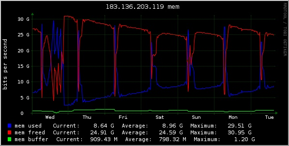
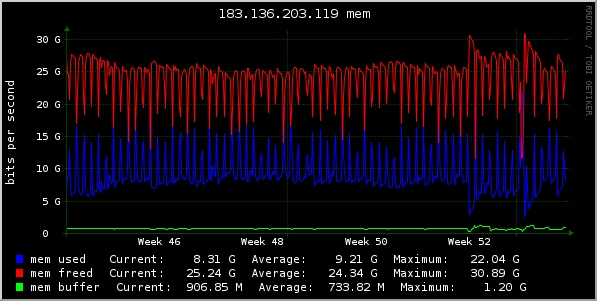

# 源站119内存报警问题原因排查优化
## 脚本梳理
> 梳理早上6点到6点30分之间所有运行脚本，并归类

### 执行一次的脚本
- `06:00:01 localhost CROND[130042]: (root) CMD (/opt/shell/rsync_apache2_logs/rsync_apache2_logs.sh)`(非项目内部脚本)
- `/opt/app/php7/bin/php  -c /opt/app/php7/etc/cron.ini  /opt/case/my.2345.com/cron/daohangPvAnalysis.php`(每日06点执行一次)(该脚本从2019-07-25以后就没有数据产生了)
- `/opt/app/php7/bin/php -c /opt/apzp/php7/etc/cron.ini^I  /opt/case/my.2345.com/cron/refreshCache.php` (有异常)(每小时执行一次)(定时监测缓存失效并更新,不影响)
    - `06:00:01 localhost CROND[130063]: (httpd) CMD (/opt/app/php7/bin/php -c /opt/apzp/php7/etc/cron.ini^I  /opt/case/my.2345.com/cron/refreshCache.php )`
    - `06:00:01 localhost CROND[130081]: (httpd) CMD (/opt/app/php7/bin/php -c /opt/app/php7/etc/cron.ini /opt/case/my.2345.com/cron/refreshCache.php`
- `/opt/app/php7/bin/php   -c /opt/app/php7/etc/cron.ini /opt/case/my.2345.com/cron/itunesUpdate.php`(每两小时执行一次)(仅拉取itunes更新状态,无影响)
- `/opt/app/php7/bin/php  -c /opt/app/php7/etc/cron.ini  /opt/case/my.2345.com/cron/multiSendMail.php`(每30分钟执行一次)(会比较耗时,一次处理100000条站内信,大概执行30分钟.但06点不一定有数据)
- `/opt/app/php7/bin/php   -c /opt/app/php7/etc/cron.ini  -q /opt/case/my.2345.com/cron/refresh_gift_list_cache.php`(每三小时执行一次)(仅刷新礼物兑换排行榜缓存及计数缓存,无影响)
- `/opt/app/php7/bin/php  -c /opt/app/php7/etc/cron.ini  /opt/case/my.2345.com/cron/alipay_transfer_to_account.php`(每两小时执行一次)(从2019-01-04后就没有转账成功过,但每天都有数据处理,平均每天1000条)
- `/opt/app/php7/bin/php    -c /opt/app/php7/etc/cron.ini  /opt/case/my.2345.com/cron/jifendownloadCheck.php`(每两小时执行一次)
- `/opt/app/php7/bin/php   -c /opt/app/php7/etc/cron.ini  /opt/case/my.2345.com/cron/get_data_from_bbs_new.php`(每30分钟执行一次)
- `/opt/app/php7/bin/php     -c /opt/app/php7/etc/cron.ini  /opt/case/my.2345.com/cron/doGiftUserCounts.php`(每日06点执行一次)(五分钟就执行完了,影响不大)
- `/opt/app/php7/bin/php  -c /opt/app/php7/etc/cron.ini  /opt/case/my.2345.com/cron/batchRegKAUsers.php`(每1小时执行一次)(每次平均耗时1秒)
- `/opt/app/php7/bin/php    -c /opt/app/php7/etc/cron.ini  /opt/case/my.2345.com/cron/refresh_gift_enable_info.php`(每1小时执行一次)(每小时定时刷新礼品上下线信息,影响不大)
- `/opt/app/php7/bin/php   -c /opt/app/php7/etc/cron.ini /opt/case/my.2345.com/cron/newoa_xiaobuwq_crwaler.php`(每日06点执行一次)(该脚本抓取域名报500错误,且脚本从2018-04-08后就没有数据了)
- `/bin/sh  /opt/shell/yunsuan/xqlm_detail.sh start`
- `/opt/shell/yunsuan/main.sh`
- `/opt/app/php7/bin/php  -c /opt/app/php7/etc/cron.ini  /opt/case/my.2345.com/cron/alipayMachineCash.php`(每3小时执行一次)(支付宝审核修正脚本,不影响)
- `/opt/app/php7/bin/php -c /opt/app/php7/etc/cron.ini   /opt/case/my.2345.com/framework/console/index.php \Cron\\PullNewDataSourceController actionRunTaoBaoNewMonthData`(每1小时执行一次)(已废弃脚本)

### */1执行一次的脚本
- 积分
    - `/opt/shell/rsync_jifen_2345/rsync_jifen_2345_if.sh`
    - `/opt/app/php7/bin/php   -c /opt/app/php7/etc/cron.ini /opt/case/my.2345.com/cron/user_sync.php`
    - `/opt/app/php7/bin/php   -c /opt/app/php7/etc/cron.ini /opt/case/my.2345.com/cron/user_sync_all.php`
    - `/opt/app/php7/bin/php  -c /opt/app/php7/etc/cron.ini  /opt/case/my.2345.com/cron/alipay_transfer_to_account.php`
    - `/opt/app/php7/bin/php    -c /opt/app/php7/etc/cron.ini  /opt/case/my.2345.com/cron/process_list.php`
    - `/opt/app/php7/bin/php   -c /opt/app/php7/etc/cron.ini  /opt/case/my.2345.com/cron/50bang.php >>/opt/logs/cron_log/50bang.log 2>&1`
    - `run-parts /etc/cron.hourly`
    - `/bin/sh /opt/shell/inotify/backup.sh`
    - `/opt/app/php7/bin/php -c /opt/app/php7/etc/cron.ini /opt/case/my.2345.com/cron/CronCityoaTechnicianPerf.php`
- 移动联盟
    - `/opt/shell/rsync_ydlm_2345/rsync_ydlm_2345_if.sh`
    - `/opt/app/php7/bin/php -c /opt/app/php7/etc/cron.ini /opt/case/ydlm.2345.com/console/index.php   \Cron\\GrowController  actionRedo`
    - `/opt/app/php7/bin/php  -c  /opt/app/php7/etc/cron.ini   /opt/case/ydlm.2345.com/console/index.php \Cron\\PushController actionMsgConsumer`
    - `/opt/app/php7/bin/php -c /opt/app/php7/etc/cron.ini /opt/case/ydlm.2345.com/console/index.php \Cron\\CronRunController actionCronRun`
    - `/opt/app/php7/bin/php -c /opt/app/php7/etc/cron.ini /opt/case/ydlm.2345.com/console/index.php   \Cron\\GrowController  actionRedo`
    - `/bin/bash /opt/case/ydlm.2345.com/shell/process_check.sh`
    - `/opt/app/php7/bin/php -c /opt/app/php7/etc/cron.ini /opt/case/ydlm.2345.com/console/index.php Cron\\SendMailController actionSendLxDetailMail`

### */2执行一次的脚本
- 移动联盟
    - `/opt/app/php7/bin/php  -c  /opt/app/php7/etc/cron.ini    /opt/case/ydlm.2345.com/console/index.php   \Cron\\PullNewAddChannelController   actionImportAlipayChannel`
    - `/opt/app/php7/bin/php  -c  /opt/app/php7/etc/cron.ini   /opt/case/ydlm.2345.com/console/index.php \Cron\\PullNewAddChannelController  actionImportJdChannel`

### */3执行一次的脚本
- 积分
    - `/opt/app/php7/bin/php    -c /opt/app/php7/etc/cron.ini  /opt/case/my.2345.com/cron/catch_php_error.php`

### */4执行一次的脚本
- 积分
    - `/opt/case/my.2345.com/cron/php_crontab.sh`
    
### */5执行一次的脚本
- 积分
    - `/bin/sh  /opt/shell/rsync_framework.sh`
    - `/opt/shell/rsync_data_new/rsync__auth_225.sh`
    - `/opt/shell/rsync_data_new/rsync_data.signboard.225.sh`
    - `/opt/app/php7/bin/php    -c /opt/app/php7/etc/cron.ini  /opt/case/my.2345.com/cron/checkSync.php`
    - `/opt/app/php7/bin/php   -c /opt/app/php7/etc/cron.ini  /opt/case/my.2345.com/cron/sms_response.php`
    - `/bin/sh /opt/shell/inotify/monitor-inotify.sh`
    - `/opt/app/php7/bin/php -c /opt/app/php7/etc/cron.ini /opt/case/my.2345.com/cron/CronCityoaTechnicianPerf.php`
    - `/opt/app/php7/bin/php -c /opt/app/php7/etc/cron.ini /opt/case/my.2345.com/cron/CronCityoaTechnicianPerf.php`
    - `/opt/app/php7/bin/php -c /opt/app/php7/etc/cron.ini   /opt/case/my.2345.com/cron/syncStarOrderStatus.php`
    - `/opt/app/php7/bin/php   -c /opt/app/php7/etc/cron.ini /opt/case/my.2345.com/cron/insertExp.php`
- 移动联盟
    - `/opt/app/php7/bin/php -c /opt/app/php7/etc/cron.ini   /opt/case/ydlm.2345.com/console/index.php \Cron\\NewUserDataController sncyUserRelation`
    - `/opt/app/php7/bin/php -c /opt/app/php7/etc/cron.ini   /opt/case/ydlm.2345.com/console/index.php \Cron\\RelationController Index`
    - `/opt/app/php7/bin/php  -c  /opt/app/php7/etc/cron.ini  /opt/case/ydlm.2345.com/console/index.php       \Cron\\SynchronizeController  syncPullNewUserToJifen`

### */15执行一次的脚本
- 积分
    - `/opt/app/php7/bin/php  -c /opt/app/php7/etc/cron.ini  /opt/case/my.2345.com/cron/insertApploginlog.php`
    - `/opt/shell/rsync_119_Protected_225/119_Protected_225.sh`
    - `/opt/app/php7/bin/php    -c /opt/app/php7/etc/cron.ini  /opt/case/my.2345.com/cron/cron_send_letter.php`
    - `/opt/app/php7/bin/php    -c /opt/app/php7/etc/cron.ini /opt/case/my.2345.com/cron/score_record_check.php`
    - `/opt/app/php7/bin/php   -c /opt/app/php7/etc/cron.ini  /opt/case/my.2345.com/cron/sms_alert.php`
    - `/opt/app/php7/bin/php  -c /opt/app/php7/etc/cron.ini /opt/case/my.2345.com/cron/appPushQueue.php`
    - `/opt/app/php7/bin/php   -c /opt/app/php7/etc/cron.ini  /opt/case/my.2345.com/cron/cron_15_min.php`

## 服务器内存状态
筛选了2020-01-01 00:00:00至2020-01-07 15:00:00的119内存使用状态如下:

均为早上6点内存占用直线上升,其他看不出异常
于是筛选了2019-11-01 00:00:00至2020-01-07 15:00:00的119内存使用状态如下:

移动联盟1.2项目为12月26日凌晨上线,由图可知,**内存问题与该版本上线并无关联.**

筛选了2020-01-01 00:00:00至2020-01-02 15:00:00的119内存使用状态如下:

当天的内存占用在1号下午两点到晚上七点左右经历了三次高峰,但具体原因未知.

TODO::向运维确认运行状态内存采集
查找其他相关解决方案

    

