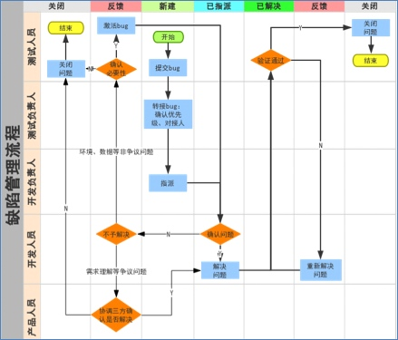

# 技术中心-缺陷管理规范
## 缺陷管理流程

### 执行原则
1. 所有**需求依据**均以**项目管理工具（QS/禅道）**中产品需求为准（有需求变更请及时更新需求），所有测试版本均以项目管理工具（QS/禅道）中项目版本为准；
2. 所有**缺陷**统一提交至项目管理工具（QS或禅道）管理系统，达到所有缺陷均可跟踪其处理进度；
3. 所有缺陷提交统一标题命名、内容格式：
标准格式：
标题：【{app/后台/接口}】【{功能模块}】{简洁描述}
内容：【版本/环境/机型/系统】【前置条件】【操作步骤】【预期结果】【实际结果】
4. 所有缺陷的解决需要备注具体的问题**原因定位、解决方式及影响范围**。

### 响应时间
1. **S级（严重）、优先级高级缺陷需要半天内给予反馈**，自己不能解决的或难度较高当天无法独立解决的需快速反馈到开发负责人，当天给予解决方案；如果当天无法给到解决方案，则交由项目经理按照高优先级任务形式推动；其**他等级缺陷，当天15点之前提交的问题当天解决，15点之后提交的问题次日内解决；**
2. 测试人员进行缺陷修复验证过程中，开发人员当天13点前提交修复包，当天验证处理完成；13点之后提交的修复包，次日中午前验证完成；如果缺陷涉及的数据在当天不能收到导致无法验证完成，必须写入日报并向上汇报；
3. 开发处理问题时，根据严重度和优先级，**优先处理严重度和优先级高的问题；**
4. 对于重复被激活多次的问题、解决一个问题引起多个问题的情况，测试人员直接反馈到测试负责人，测试负责人与开发负责人沟通。

### 争议解决
争议性问题必须要经过**产品、研发、测试**三方沟通确认并注明处理方式及具体原因。

## 缺陷级别定义
1. 禅道S级（QS系统中严重级别）：**不能满足项目要求，基本功能不能使用；造成系统卡死、无响应；崩溃、闪退等导致App不能继续运行。**
2. 禅道A级（QS系统中关键级别）：**部分主要功能未按需求实现，一些场景下功能不可用或产生错误结果，而且是常规操作中经常发生或非常规操作中必现的问题。**
3. 禅道B级（QS系统中一般级别）：**产生错误中间结果但不影响最终结果，产生错误结果但不容易重现的问题**
4. 禅道C级（QS系统中建议级别）：**不符合常规用户习惯，界面样式错误等小问题或者需要完善的地方**

## 类型定义
### 功能类
**需求理解错误、代码编写错误、实现与需求不符等，会影响用户使用体验、功能不正常、影响数据统计、资金安全的缺陷**
### 兼容类
**代码不能稳定的工作在业务场景需要的环境中，影响用户正常使用的缺陷**
### 需求类
**需求存在业务逻辑或业务场景的缺失，明显违背客观规律、业务逻辑、管理制度要求，或实现需求对当前系统有严重危害等情况，影响开发实现及用户使用的需求问题**
### 安全类
**代码编写问题造成的信息泄露、sql注入、xss跨站访问等，造成串号、盗号、越权等风险，影响用户信息安全的缺陷**
### 性能类
**代码编写问题造成的内存泄漏、响应过慢、服务器负载陡增、客户端耗电量过高等缺陷**

## 优先级定义
- 高优先级：**需要立刻解决的问题**
    1. 造成需求的关键流程无法走通；
    2. 严重影响测试进度，无法进行下一步校验；
- 中优先级：**需要在指定时间内解决的问题**
    1. 属于需求包含的重要功能，如不解决属于功能缺失、无法上线；
- 低优先级：**产品开发计划内解决的问题（可延期到资源充沛时解决）**
    1. 属于优化项，不影响需求包含内容正常上线和使用。

