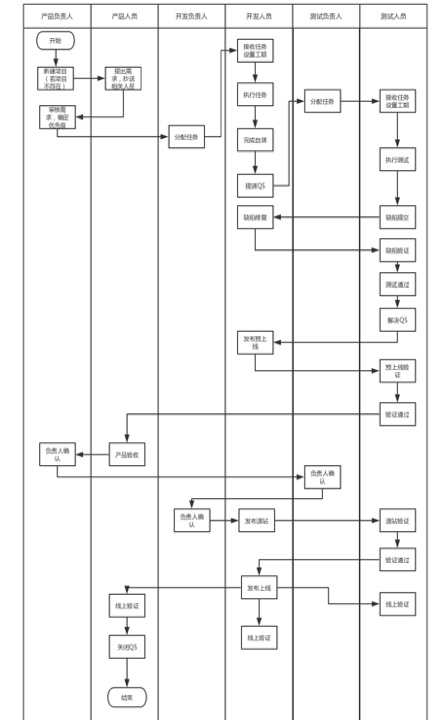

# 技术中心-项目管理系统使用规范
## 协作流程图

## 开发执行细则
### 任务接收
1. **所有需要开发的任务必须走QS**，不能私自接受任务，所有上线的QS都需要经过测试（紧急发布例外）；
2. **开发负责人**接收任务前需要针**对需求质量进行把关**，需求不合理或者需求文档不清晰，有权力拒绝并要求需求细化；
3. **开发负责人**需要备注优先级和评估开发时间，然后分配任务；
4. **开发人员只接受从直属上级转过来的任务**，开始开发的时候点接受，并填写开发工期。

### 任务完成
1. 开发工期**不足3人日**的，需要**备注改动点和影响点**在任务交流区；
2. 开发工期**超过2人日**的，必须**上传提测相关的资源**，如接口文档，设计文档；
3. **开发完成后，进行开发自测**，自测通过后点击完成。

