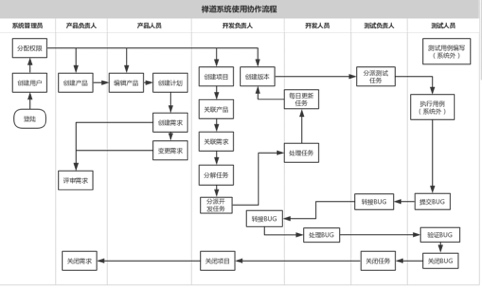

# 技术中心-项目管理系统使用规范（禅道）
## 协作流程

## 执行阶段
1. 立项阶段
    1. 创建产品（维护角色：项目经理）
2. 需求阶段
    1. 创建计划（维护角色：产品人员）
    2. 创建/变更需求（维护角色：产品人员）
    3. 评审需求（维护角色：产品负责人）
3. 开发阶段
    1. 创建项目（维护角色：开发负责人）
    2. 维护团队（维护角色：开发负责人）
    3. 关联需求（维护角色：开发负责人）
    4. 创建（分解、分派）任务（维护角色：开发负责人）
    5. 任务执行（维护角色：开发人员）
    6. 创建版本（维护角色：开发负责人）
4. 测试阶段
    1. 测试准入（维护角色：测试负责人）
    2. 指派任务（维护角色：测试负责人）
    3. 缺陷管理（维护角色：测试人员）
5. 上线阶段
    1. 关闭任务（维护角色：测试负责人）
    2. 关闭项目（维护角色：开发负责人）
    3. 关闭需求（维护角色：项目经理，产品负责人）