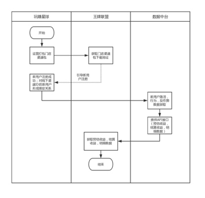

# 业务梳理
## 需求目的
给星球联盟带量
## 需求问题提出
### 三方业务交互流程

- 运算这块放到中台做了？

### 定价规则
- 单价是固定2块吗？

### 数据字段及来源
- t+5早上十点展示还是运算后展示？
- 预估汇总
    - _用户注册时填写的邀请码是不是渠道id？_
    - _特定渠道是指什么？跟注册渠道什么区别？_
    - 线下特定渠道跟线上什么区别，怎样算绑定关系？
    - 有必要将注册获得40金币作为判断依据吗？40金币是不是只要注册都有的，而且这个数据怎么存？
    - 怎样算激活？激活天数的依据是什么
    - 激活三日和激活四日用户数有什么区别？

#### 前端页面
- 百度好看的入口要去掉吗
- 预估收益展示逻辑同团队管理一期需求？
- $(3*1+2*2+4*3)*2*(50\%-30\%)$
